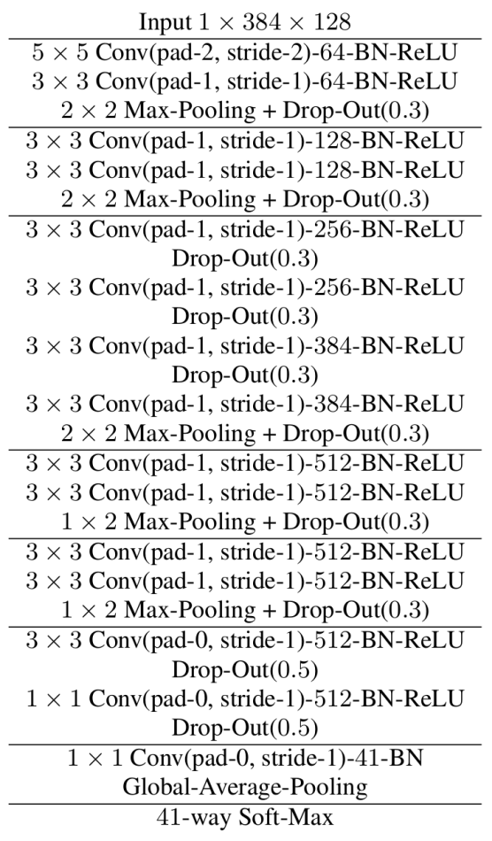
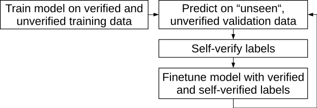
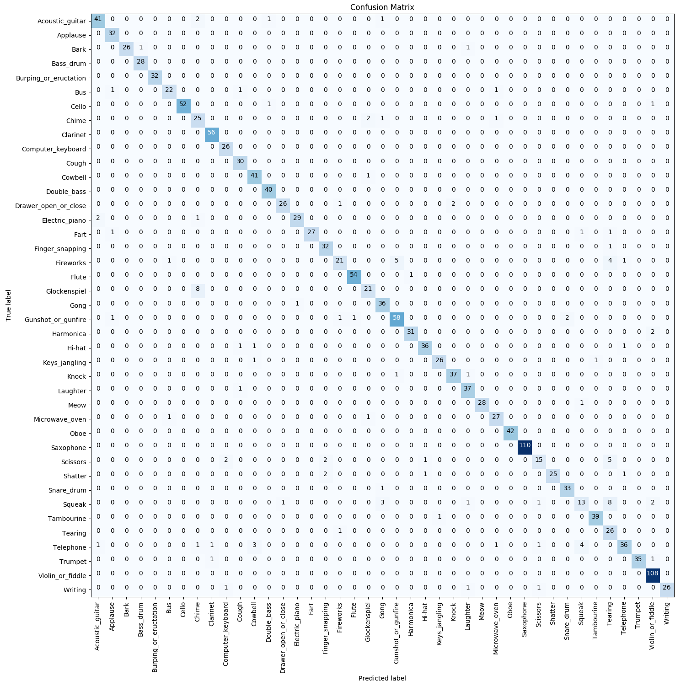

<style>
div.info {    
    background-color: #e5efff;
    border-color: #a2c3f9;
    border-left: 5px solid #a2c3f9;
    border-right: 5px solid #a2c3f9;
    border-top: 5px solid #a2c3f9;
    border-bottom: 5px solid #a2c3f9;
    padding: 0.5em;
    }
</style>

I am [Matthias Dorfer](https://www.jku.at/en/institute-of-computational-perception/about-us/people/matthias-dorfer/) and at the time preparing this writeup
working as a Research Assistant (PhD Candidate) under the supervision of [Prof. Gerhard Widmer](https://www.jku.at/en/institute-of-computational-perception/about-us/people/gerhard-widmer/) at the [Institute of Computational Perception](https://www.jku.at/en/institute-of-computational-perception/) at [Johannes Kepler University Linz](https://www.jku.at/en/).

In the following I describe my submission to the first
[Freesound general-purpose audio tagging challenge](http://dcase.community/challenge2018/task-general-purpose-audio-tagging)
carried out as Task 2 within the [DCASE challenge 2018](http://dcase.community/challenge2018/).
In fact this writeup is very similar (and based on) our workshop paper
at the [DCASE workshop](http://dcase.community/workshop2018/) organized along with the challenge:

<div class="info">
Matthias Dorfer and Gerhard Widmer.
"Training General-Purpose Audio Tagging Networks with Noisy Labels and Iterative Self-Verification".
Workshop on Detection and Classification of Acoustic Scenes and Events (DCASE2018), Surrey, UK, 2018
</div>

However, this writeup also contains more technical details,
the code snippets for running the challenge code,
a more detailed presentation of the experimental results and performance of the system,
as well as instructions on how to run a live version of the audio tagging system.

The proposed solution is based on a fully convolutional neural network that predicts one out of 41 possible audio class labels when given an audio spectrogram excerpt as an input.
What makes this classification dataset and the task in general special,
is the fact that only 3,700 of the 9,500 provided training examples
are delivered with manually verified ground truth labels.
The remaining non-verified observations are expected to contain a substantial amount of label noise (up to 30-35\% in the ``worst" categories).
I address this issue by a simple, iterative self-verification process,
which gradually shifts unverified labels into the verified, trusted training set.
The decision criterion for self-verifying a training example is
the prediction consensus of a previous snapshot of the network
on multiple short sliding window excerpts of the training example at hand.
This procedure requires a carefully chosen cross-validation setup,
as large enough neural networks are able to learn an entire dataset by heart, even in the face of noisy label data.
On the unseen test data, an ensemble of three networks trained with this self-verification approach
achieves a mean average precision (MAP@3) of 0.951.
This is the second best performing system to the corresponding
[Kaggle challenge](https://www.kaggle.com/c/freesound-audio-tagging/leaderboard).

The rest of this writeup is structured as follows:
- [Introduction](#introduction)
- [Audio Data Pre-processing](#audio-data-pre-processing)
- [Network and Training Details](#network)
- [4-Fold Iterative Self-Verification](#4-fold-iterative-self-verification)
- [Experimental Results](#experimental-results)
- [Summary](#summary)
- [Running the Code](#running-the-code)
- [Live Audio Tagger](#live-audio-tagger)

For a detailed description of the entire system you are invited to read the entire writeup.
If you are only interested in how to run the code I recommend to directly jump to the Section *[Running the Code](#running-the-code)*.
If you would like to try a live-version of the system go to [Live Audio Tagger](#live-audio-tagger).


<br>
# Introduction

This short writeup describes my approach to the first "Freesound General-purpose Audio Tagging Challenge" which is carried out as [Task 2 of the DCASE 2018 Challenge](http://dcase.community/challenge2018/task-general-purpose-audio-tagging) ([here is a link to the corresponding paper](https://arxiv.org/abs/1807.09902)).
The central motivation for this challenge is to foster research towards more general
machine listening systems capable of recognizing and discerning a wide range of acoustic events and audio scenes.

In particular, the challenge aims at building an audio tagging system
which assigns one out of 41 potential candidate labels to an unknown audio recording of arbitrary length.
The labels comprise sound events such as music instruments, human sounds, animals, or domestic sounds.

What makes working with this data challenging is twofold:
Firstly, the data set is collected from [Freesound](https://freesound.org/),
which is a repository for user-generated audio recordings capturing diverse content
with highly varying signal lengths
recorded under diverse conditions ([here is a link to the dataset paper](https://repositori.upf.edu/handle/10230/33299)).
Secondly, the development (or training) dataset is delivered only partly with manually annotated ground truth labels.
For the remaining recordings the labels are automatically generated
and comprise up to 30-35\% label noise in the ``worst" categories.
In the remainder of this paper, we refer to the manually annotated training observations as *verified* and to the additionally automatically annotated observations as *unverified*.

The central idea of my approach is to address the problem of noisy labels
by training a fully convolutional audio classification network,
which is iteratively fine-tuned by self-verifying the parts of the training observations
provided without manually verified ground truth.
Due to the specifics of the current task (the labels of a large fraction of the data have verified manually and thus can be trusted),
I opted for a straight forward iterative self-verification strategy.
More concretely, to verify possibly noisy labels, the proposed approach compares the labels of unverified examples with the predictions of a neural network,
i.e. this can be interpreted as a version of "supervised" pseudo labeling.


<br>
# Audio Data Pre-processing

Before presenting the data to the networks,
I apply several audio preprocessing steps
including silence clipping and spectrogram computation.

The first step of the pipeline is normalizing the audio signal to a dB-level of -0.1.
Next potential silence in the beginning and the end of the normalized audio is clipped using [SoX](http://sox.sourceforge.net).
This step is important as we later on optimize the networks on short sliding windows of the original files
and want to avoid presenting training observations containing only silence along with the original label of the file.
The figure below shows an audio example of class *Knock* where this preprocessing step has
a severe impact, reducing the effective length of the spectrogram from 435 to only 186 frames.
Note that the part of the spectrogram covering actual audio content is preserved.


The actual sox command used in the code for pre-processing the signals is:
```
sox <infile>.wav <outfile>.wav norm -0.1 silence 1 0.025 0.15% norm -0.1 reverse silence 1 0.025 0.15% reverse
```

Before computing the spectrograms the audio signals are re-sampled to 32,000 Hz,
and a Short Time Fourier Transform (STFT) using 1024-sample hann windows is computed.
To try to capture different aspects of the audio,
I extract two different spectrogram versions for the final submission:

**Version-1** uses an STFT hop-size of 192 samples.
Given this raw spectrogram, we apply a perceptual weighting to the individual frequency bands of the power spectrogram [librosa](http://librosa.github.io/librosa/).
As a last step, a mel-scaled filterbank reduces the dimensionality of the spectrograms to 128 frequency bins per data point.

```python
import librosa
import numpy as np

sig, sr = librosa.load(file_path, sr=sr, mono=True)
sig = sig[np.newaxis]
stft = librosa.stft(y, n_fft=n_fft, hop_length=hop_length, win_length=None, window='hann', center=True, pad_mode='reflect')
stft = np.abs(stft)
freqs = librosa.core.fft_frequencies(sr=sr, n_fft=n_fft)
stft = librosa.perceptual_weighting(stft**2, freqs, ref=1.0, amin=1e-10, top_db=99.0)
spectrogram = librosa.feature.melspectrogram(S=stft, sr=sr, n_mels=n_mels, fmax=fmax)
```

**Version-2** uses an STFT hop-size of 128 samples and does not apply perceptual weighting
but takes the logarithm of the power spectrogram instead.
Finally it is post-processed with a logarithmic filter-bank again resulting in 128 frequency bins.
I used [madmom](https://madmom.readthedocs.io/en/latest/introduction.html) to extract this second spectrogram.
```python
from madmom.audio.signal import SignalProcessor, FramedSignalProcessor
from madmom.audio.spectrogram import SpectrogramProcessor, LogarithmicFilteredSpectrogramProcessor
from madmom.audio.filters import LogFilterbank
from madmom.processors import SequentialProcessor, Processor

sig_proc = SignalProcessor(num_channels=1, sample_rate=32000, norm=True)
fsig_proc = FramedSignalProcessor(frame_size=1024, hop_size=128, origin='future')
spec_proc = SpectrogramProcessor(frame_size=1024)
filt_proc = LogarithmicFilteredSpectrogramProcessor(filterbank=LogFilterbank, num_bands=26, fmin=20, fmax=14000)
processor_version2 = SequentialProcessor([sig_proc, fsig_proc, spec_proc, filt_proc])
```

An additional characteristic of the data at hand is the varying length of the recordings.
The Histogram below shows the distribution of spectrogram lengths for spectrogram *Version-1*.


As convolutional neural networks -- which are the central component of my approach --
in general have a fixed field of view (input dimensions),
it is desirable to work with audio excerpts consisting of the same number of frames.
Additionally, to design convolution networks including max-pooling layers
with a certain depth, we need to exceed a minimum input dimensionality
(After each max-pooling layer the dimensionality of the input / feature maps gets halved.
This of course restricts the maximum depth of a network.).

To that end, I fix a target length of 3000 frames and simply repeat a given excerpt in case it is too short and clip it at 3000 frames in case it is too long.
The 3000 frame threshold is chosen intuitively as the spectrogram length distribution above has a long tail with few observations.

## Code for Preparing the Spectrograms
The whole code for preprocessing the data is provided in the script **prepare_spectrograms.py**.
To compute the spectrograms on the Kaggle data run:
```
python prepare_spectrograms.py --audio_path <DATA_ROOT>/audio_train --spec_path <DATA_ROOT>/specs_train_v1 --spec_version 1 --dump
python prepare_spectrograms.py --audio_path <DATA_ROOT>/audio_test --spec_path <DATA_ROOT>/specs_test_v1 --spec_version 1 --dump
```

This assumes the following folder structure:
```
<DATA_ROOT>
    - audio_train
    - audio_test
    - train.csv
    - test_post_competition.csv
```

For spectrogram *version-2* this works analogously.<br>
If you would like to take a look at some of the spectrograms run:
```
python prepare_spectrograms.py --audio_path <DATA_ROOT>/audio_train --spec_version 1 --show 10
```

<br>
# Network and Training Details

This section describes the neural network architectures as well as the optimization
strategies used for training the audio scene classification networks.

## Network Architecture

The basic network architecture is a fully convolutional neural network as depicted below:



In total I use three slightly modified versions of this architecture for our submission,
but the general design principles remain the same.

**Hint:** You can find the three architectures in the sub-folder models in the repository.

The feature learning part of our model follows a VGG style network,
and the classification part of the network is designed as a global average pooling layer over 41 feature maps (one for each class)
followed by a *softmax* activation.
In my experiments,
global average pooling over per-class feature maps
consistently outperformed networks using fully connected layers as a classification output.
As an activation function within the network Rectified Linear Units (ReLUs) in combination with batch-normalization are used.
Overall, this model comprises 14,865,124 trainable parameters.

## General Training Procedure

At training time, the network is optimized with randomly selected 384 frame excerpts of the full spectrograms,
while at testing time predicts on the whole 3,000 frame spectrograms.
This is technically possible as the network contains only convolution and pooling layers
and can therefore process audio excerpts of varying length.
Intuitively, presenting shorter excerpts for training should mitigate the effect of over-fitting to the individual training examples,
as we end up with a much larger amount of shorter sub-excerpts.
To further prevent over-fitting,
I additionally apply [mixup-data augmentation](https://arxiv.org/abs/1710.09412) with an *alpha* of 0.3.

As optimizer the ADAM update rule with an initial learning rate of 0.001 and a mini-batch size of 100 samples
is used for training the initial version of our models.
Each model is trained for 500 epochs,
where the learning rate is linearly decayed to zero starting from epoch 100.
When fine-tuning the models with iterative self-verification (see below),
a slightly modified training setup is employed.

For training the model above with this training configuration you can run the command below.
In fact this will train four models (for four different folds) in parallel.
Details on why and how I split the data will follow in the next section.
```
./run_experiment.sh dcase "python train.py --model models/vgg_gap_spec1_1.py --data tut18T2-specs_train_v1 --max_len 3000"
```

<br>
# 4-Fold Iterative Self-Verification

This section describes the iterative self-verification loop
to address the noisy labels in the development dataset.
The central idea is to gradually shift unverified labels into the verified, trusted training set
for fine-tuning the models.

## 4-Fold Cross-Validation Setup

One crucial component of this self-verification approach is the way
how the training-validation-setup is prepared.
To enable the proposed step-wise verification approach,
we have to design our folds in a way that parts of the data (which we would like to verify) are never presented to the verification model for training.
Otherwise, the neural network would learn the entire training set by heart,
[as we know even in the presence of noisy labels](https://arxiv.org/abs/1611.03530),
and its prediction become worthless for the verification strategy.
The figure below provides an overview on how to prepare this split.


First, the development dataset is separated into verified and unverified observations.
Second, we split each of the two subsets into four [stratified sub-folds](http://scikit-learn.org/stable/modules/generated/sklearn.model_selection.StratifiedKFold.html#sklearn.model_selection.StratifiedKFold),
meaning that the label distribution in the sub-folds remains the same as in the original dataset.
We consider this an important detail as the challenge organizers state on the [official web page](https://www.kaggle.com/c/freesound-audio-tagging/data)
that the unseen test data exhibits a similar label distribution.

*"The test set is composed of ~1.6k samples with manually-verified annotations and with a similar category distribution than that of the train set."*

In fact, for selecting the final submission I did not rely on the public Kaggle-Leaderboard
but on the average performance on my local 4-fold cross-validation setup.
Each of the local validation folds contains approximately 900 verified files
which is substantially more than the 300 files (19% of official test data) considered for the public leaderboard.
Although preparing this validation setup is straight forward,
it is a crucial step as it is the basis for the self-verification pipeline described next.

## Iterative Self-Verification Loop

The figure below provides an overview of our iterative self-verification loop.



Step one of this procedure is to train an initial model
utilizing all the training data of a fold also including the unverified samples.
We train one model for each fold as described above
and keep the best parametrization according to its validation loss on the verified validation data excluded from training.
Note that the unverified data is not considered for model selection.
This is also the main reason for compiling separate stratified splits for verified and unverified observations
as the verified split should provide us with an as reliable estimate of the real model performance as possible.

Once the initial model is trained it is used to predict the labels of its respective unseen validation examples.
However, in contrast to the model selection we now only predict on the unverified observations.
In particular, we draw *K* random 384 frame excerpts of the original 3000 frame spectrograms of the audio clip to verify
and compute the average of the individual *K* posterior class distributions where we set *K=25* in practice.

We then proceed by considering unverified examples as correctly annotated if:
1. The provided unverified label matches the label predicted by the average of the individual posterior distributions.
2. The average of the target class posteriors exceeds 0.95.
3. A maximum count of 40 self-verified examples per class is not yet reached.

The intuition behind this approach is that especially for the unverified training examples
multiple different classes might be present in a single audio recording.
Still it is annotated with a single and hence unreliable label.
When predicting on multiple random sub-excerpts of the recording
this should be revealed by exhibiting a low average posterior probability for the provided target class label.
The last condition for self-verification is introduced as some classes have very few examples
and we want to avoid shifting the original label distribution of the dataset.
As this procedure is based on four distinct cross-validation folds
each unverified example is considered for verification once per iteration.

To execute the code for the first iteration of this self-verification stage run:
```
python self_verify.py --model models/vgg_gap_spec2.py --spec_dir specs_train_v2 --top_probs_thresh 0.95 --k_per_class 40 --no_len_fix --min_len 3000 --max_len 3000 --stochastic --train_file train_self_verified_it0.csv --tag it0
```

The final stage of this self-verification loop is to fine-tune the four initial fold models,
this time using the officially provided verified observations
and the ones passing the self-verification conditions in the previous stage.
For the fine-tuning stage we train for 30 epochs with an initial learning rate of 0.0002,
which is again decayed to zero starting after five epochs.
We do not use mixup data augmentation in this stage anymore.
After fine-tuning we go back to step two and repeat the whole procedure in a loop for ten times.
Note that we do not reset the network to the initial parameterization after each fine-tuning iteration but continue training the same model.

To fine-tune the model with the self-verified examples from the previous step run the command below.
(**Note that this is again only for the first iteration. I provide scripts in my repository which run all the code with one call.**):
```
./run_experiment.sh dcase "python train.py --model models/vgg_gap_spec2.py --data tut18T2ver-specs_train_v2 --ini_params params_%d_it0 --max_len 3000 --train_file train_self_verified_it0.csv --tag it1 --fine_tune"
```

Once the ten iterations are completed, we select the model parameterization of the iteration
showing the lowest average validation loss on the officially verified validation data.<br>
**Info:** I selected the best models (iterations) manually by visual inspection.


<br>
# Experimental Results

This section reports the empirical results on both,
the local validation setup as well as the public and private Kaggle-Leaderboard.
As evaluation measures we consider the Mean Average Precision @ 3 (MAP@3),
which is the score officially used for the challenge,
as well as classification accuracy and Precision, Recall, and F-score
for presenting the performance on individual classes.

The plot below shows training and validation accuracy on the local 4-fold setup of the model described above
when training on the entire dataset including unverified labels.


This corresponds to the first stage of the self-verification procedure.
The plot reports mean and standard deviation of the network across the four distinct folds
where the best average accuracy on the validation set after stage one is 93.87%.
To create this plot run:
```
python lasagne_wrapper/plot_log.py <EXP_ROOT>/experiments/dcase_task2/vgg_gap_spec1_1/results_[1,2,3,4]_it0.pkl --acc --folds_avg
```

The next plot shows the performance of the same model
after the first and seventh fine-tuning iteration.
Already after the first self-verification iteration, we observe a performance improvement to 95.56%.
Finally, the model reaches its best performance in iteration seven with an average verified validation set performance of 96.01%.


Before preparing my final submission for the challenge,
I trained three similar networks to the one in described above (two on spectrogram *version-1* and one on spectrogram *version-2*)
and averaged their predictions.
When evaluating this submission on the official test data set we achieve the second best scoring submission
in the [final private Kaggle-Leaderboard](https://www.kaggle.com/c/freesound-audio-tagging/leaderboard)
with a **MAP@3 of 0.9518**.
For easier comparability with future research on this dataset,
I also report detailed results on the different subsets of the test data:

|          | Public | Private | Public & Private |
| -------- | ------ | ------- | ---------------- |
| MAP@3    | 0.9563 | 0.9518  | 0.9526           |
| Accuracy | 93.688 | 92.610  | 92.812           |

To provide an intuition on how well the approach performs on individual classes,
I also report Precision, Recall, and F-score for all 41 individual classes:


We observe that the model achieves an F-score above 0.8 for all classes
except for *Squeak*, *Fireworks*, and *Glockenspiel*.
Many of the classes are even recognized with a perfect score of 1.0.
Considering the noisy labels and that there are 41 different classes to distinguish
this is a remarkable result.

For evaluating a single fold-model on either the local validation fold
or on one of the leaderboard fractions run:
```
python eval.py --model models/vgg_gap_spec1_1.py --tag it0 --data tut18T2-specs_train_v1 --set private_public --max_len 3000 --min_len 3000 --no_len_fix --fold 1
```
Possible options for the argument set are (valid, private, public, private_public).

Finally, to also allow for an investigation of which classes get confused with each other
I provide the full confusion matrix in the figure below
(open the image in a new tab to get a nicer view on it):



<br>
# Summary

In this writeup, I described my submission to the first
Freesound general-purpose audio tagging challenge carried out with DCASE 2018.
The suggested approach is an iterative self-verification loop built
on top of a fully convolutional neural network.
After an initial training stage using all the data,
the networks are iteratively fine-tuned using label self-verification.
The central idea is to add unverified examples to the training set
based on the prediction consensus of the networks with the suggested, noisy labels.
For a single model, this approach improves the classification accuracy from 93.87% to 96.01% on the local validation set.
When training an ensemble of three similar networks in this fashion,
their averaged prediction achieves a MAP@3 of 0.9518 (92.610% accuracy) on the final private Kaggle-Leaderboard.
Overall this yields the second best scoring out of 558 submissions.


<br>
# Running the Code

Below I provide the code snippets for training and evaluating all models contributing to my submission.
The scripts assume that there are four GPUs available for training (one for each fold).
With four GPUs all experiments should be complete in approximately two days of training.
If you have only one GPU available running the code will take of course four times as long.

## Data Preparation

For a description on how to prepare the audio signals
for training please see [Code for Preparing the Spectrograms](#code-for-preparing-the-spectrograms).

## Training

Pre-train all models using both verified and unverified data:
```
python run_experiment_set.py --experiment_set pretrain
```

Fine-tune models using iterative self-verification
```
python run_experiment_set.py --experiment_set finetune
```

Alternatively, you can also run both stages after each other with one call:
```
python run_experiment_set.py --experiment_set all
```

When running the last command you will get the following output:

```
Running experiment (1 / 63)
./run_experiment.sh dcase "python train.py --model models/vgg_gap_spec2.py --data tut18T2-specs_train_v2 --max_len 3000"
THEANO_FLAGS="device=cuda0" python train.py --model models/vgg_gap_spec2.py --data tut18T2-specs_train_v2 --max_len 3000 --fold 1
THEANO_FLAGS="device=cuda1" python train.py --model models/vgg_gap_spec2.py --data tut18T2-specs_train_v2 --max_len 3000 --fold 2
THEANO_FLAGS="device=cuda2" python train.py --model models/vgg_gap_spec2.py --data tut18T2-specs_train_v2 --max_len 3000 --fold 3
THEANO_FLAGS="device=cuda3" python train.py --model models/vgg_gap_spec2.py --data tut18T2-specs_train_v2 --max_len 3000 --fold 4
Running experiment (2 / 63)
./run_experiment.sh dcase "python train.py --model models/vgg_gap_spec1_1.py --data tut18T2-specs_train_v1 --max_len 3000"
THEANO_FLAGS="device=cuda0" python train.py --model models/vgg_gap_spec1_1.py --data tut18T2-specs_train_v1 --max_len 3000 --fold 1
THEANO_FLAGS="device=cuda1" python train.py --model models/vgg_gap_spec1_1.py --data tut18T2-specs_train_v1 --max_len 3000 --fold 2
THEANO_FLAGS="device=cuda2" python train.py --model models/vgg_gap_spec1_1.py --data tut18T2-specs_train_v1 --max_len 3000 --fold 3
THEANO_FLAGS="device=cuda3" python train.py --model models/vgg_gap_spec1_1.py --data tut18T2-specs_train_v1 --max_len 3000 --fold 4
Running experiment (3 / 63)
./run_experiment.sh dcase "python train.py --model models/vgg_gap_spec1_2.py --data tut18T2-specs_train_v1 --max_len 3000"
THEANO_FLAGS="device=cuda0" python train.py --model models/vgg_gap_spec1_2.py --data tut18T2-specs_train_v1 --max_len 3000 --fold 1
THEANO_FLAGS="device=cuda1" python train.py --model models/vgg_gap_spec1_2.py --data tut18T2-specs_train_v1 --max_len 3000 --fold 2
THEANO_FLAGS="device=cuda2" python train.py --model models/vgg_gap_spec1_2.py --data tut18T2-specs_train_v1 --max_len 3000 --fold 3
THEANO_FLAGS="device=cuda3" python train.py --model models/vgg_gap_spec1_2.py --data tut18T2-specs_train_v1 --max_len 3000 --fold 4
Running experiment (4 / 63)
python self_verify.py --model models/vgg_gap_spec2.py --spec_dir specs_train_v2 --top_probs_thresh 0.95 --k_per_class 40 --no_len_fix --min_len 3000 --max_len 3000 --stochastic --train_file train_self_verified_it0.csv --tag it0
...
```

## Evaluation
Once the models are trained you can already evaluate them on the local validation folds ...

```
python eval.py --model models/vgg_gap_spec1_1.py --tag it0 --data tut18T2-specs_train_v1 --set valid --max_len 3000 --min_len 3000 --no_len_fix --fold 1
```

... or (as the challenge ground truth is released) on the public, private, private_public leaderboards:
```
python eval.py --model models/vgg_gap_spec1_1.py --tag it0 --data tut18T2-specs_train_v1 --set private --max_len 3000 --min_len 3000 --no_len_fix --fold 1
```

This will get you something like this:
```
Using cuDNN version 7005 on context None
Mapped name None to device cuda3: GeForce GTX 1080 Ti (0000:82:00.0)
Loading data ...
Loading model parameters ...
tagged parameter dump file /home/matthias/experiments/dcase_task2/vgg_gap_spec1_1/params_1_it0.pkl
Predicting on test set ...
Processing file 1299 / 1299

Results on fold 1


                         LABEL  |  CNT  |   ACC   |   PR   |   RE   |    F1    |
----------------------------------------------------------------------
               Acoustic_guitar  |  036  |  0.861  |  0.86  |  0.86  |  0.861   |
                      Applause  |  026  |  1.000  |  0.90  |  1.00  |  0.945   |
                          Bark  |  023  |  0.913  |  0.95  |  0.91  |  0.933   |
                     Bass_drum  |  023  |  1.000  |  0.82  |  1.00  |  0.902   |
         Burping_or_eructation  |  026  |  0.962  |  1.00  |  0.96  |  0.980   |
                           Bus  |  020  |  0.500  |  1.00  |  0.50  |  0.667   |
                         Cello  |  044  |  0.977  |  0.98  |  0.98  |  0.977   |
                         Chime  |  024  |  0.750  |  0.55  |  0.75  |  0.632   |
                      Clarinet  |  045  |  0.978  |  0.96  |  0.98  |  0.967   |
             Computer_keyboard  |  021  |  1.000  |  0.88  |  1.00  |  0.933   |
                         Cough  |  024  |  0.917  |  0.79  |  0.92  |  0.846   |
                       Cowbell  |  034  |  0.912  |  0.94  |  0.91  |  0.925   |
                   Double_bass  |  032  |  0.969  |  1.00  |  0.97  |  0.984   |
          Drawer_open_or_close  |  024  |  0.792  |  0.90  |  0.79  |  0.844   |
                Electric_piano  |  026  |  0.731  |  0.95  |  0.73  |  0.826   |
                          Fart  |  024  |  0.833  |  0.83  |  0.83  |  0.833   |
               Finger_snapping  |  027  |  0.926  |  0.89  |  0.93  |  0.909   |
                     Fireworks  |  026  |  0.692  |  0.82  |  0.69  |  0.750   |
                         Flute  |  044  |  0.977  |  0.93  |  0.98  |  0.956   |
                  Glockenspiel  |  024  |  0.583  |  0.88  |  0.58  |  0.700   |
                          Gong  |  030  |  0.967  |  0.72  |  0.97  |  0.829   |
            Gunshot_or_gunfire  |  051  |  0.725  |  0.86  |  0.73  |  0.787   |
                     Harmonica  |  027  |  0.778  |  1.00  |  0.78  |  0.875   |
                        Hi-hat  |  032  |  0.875  |  0.97  |  0.88  |  0.918   |
                 Keys_jangling  |  023  |  0.783  |  0.86  |  0.78  |  0.818   |
                         Knock  |  032  |  0.812  |  0.84  |  0.81  |  0.825   |
                      Laughter  |  031  |  0.806  |  0.81  |  0.81  |  0.806   |
                          Meow  |  024  |  0.917  |  1.00  |  0.92  |  0.957   |
                Microwave_oven  |  024  |  0.958  |  0.68  |  0.96  |  0.793   |
                          Oboe  |  034  |  0.971  |  0.97  |  0.97  |  0.971   |
                     Saxophone  |  088  |  1.000  |  0.99  |  1.00  |  0.994   |
                      Scissors  |  020  |  0.550  |  0.73  |  0.55  |  0.629   |
                       Shatter  |  024  |  0.833  |  0.80  |  0.83  |  0.816   |
                    Snare_drum  |  028  |  0.857  |  0.89  |  0.86  |  0.873   |
                        Squeak  |  024  |  0.500  |  0.52  |  0.50  |  0.511   |
                    Tambourine  |  032  |  1.000  |  0.97  |  1.00  |  0.985   |
                       Tearing  |  022  |  0.955  |  0.54  |  0.95  |  0.689   |
                     Telephone  |  039  |  0.718  |  0.97  |  0.72  |  0.824   |
                       Trumpet  |  030  |  0.967  |  0.97  |  0.97  |  0.967   |
              Violin_or_fiddle  |  087  |  0.989  |  0.92  |  0.99  |  0.956   |
                       Writing  |  024  |  0.917  |  0.92  |  0.92  |  0.917   |
----------------------------------------------------------------------
                       average  |  1299  |  0.857  |  0.87  |  0.86  |  0.856   |
======================================================================
Overall Accuracy: 87.683 %
======================================================================

 MAP@3: 0.912
```

## Preparing and Evaluating a Leaderboard Submission
As the final submission is an average (ensemble) of three different models
we need a few more scripts to get to the final submission.

### Prepare Test-Set Predictions
The first step is to prepare all the predictions of the individual fold models on the test set:
```
./run_experiment.sh test "python eval.py --model models/vgg_gap_spec1_1.py --data tut18T2-specs_train_v1 --max_len 3000 --min_len 3000 --no_len_fix --set test --tag it3 --dump_results"

./run_experiment.sh test "python eval.py --model models/vgg_gap_spec1_2.py --data tut18T2-specs_train_v1 --max_len 3000 --min_len 3000 --no_len_fix --set test --tag it7 --dump_results"

./run_experiment.sh test "python eval.py --model models/vgg_gap_spec2.py --data tut18T2-specs_train_v2 --max_len 3000 --min_len 3000 --no_len_fix --set test --tag it10 --dump_results"
```

**Note: The iterations selected above were the best ones in my train runs.
If you train your own models make sure to pick the best iterations for the three network architectures.
You can figure out which ones are the best via visual inspection with the *plot_log.py* script**

```
python lasagne_wrapper/plot_log.py <EXP_ROOT>/experiments/dcase_task2/vgg_gap_spec1_1/results_[1,2,3,4]_it0.pkl --acc --folds_avg
```

### Average Test-Set Predictions
Given these predictions we fuse them using simple prediction averaging:<br>
```
python fusion.py test <EXP_ROOT>/vgg_gap_spec1_1/probs_test_tut18T2-specs_train_v1_[1,2,3,4]_it3.pkl <EXP_ROOT>/vgg_gap_spec1_2/probs_test_tut18T2-specs_train_v1_[1,2,3,4]_it7.pkl <EXP_ROOT>/vgg_gap_spec2/probs_test_tut18T2-specs_train_v2_[1,2,3,4]_it10.pkl --out probs_task2_avg_fusion_final.pkl
```

**Note: You have to replace *\<EXP_ROOT\>* with your experimental root path.**

### Prepare and Evaluate a Submission
Based on these averaged predictions we can prepare the final submission file:
```
python prepare_tut18_task2_submission.py --prediction_file probs_task2_avg_fusion_final.pkl --out_file subm_task2_avg_fusion_final.txt
```

You can evaluate the performance of this submission using the following command:
```
python evaluate_leaderboard.py --submission_file subm_task2_avg_fusion_final.txt --set private
```
As leaderboard evaluation sets you can pick either *private*, *public*, or *private_public*.


<br>
# Live Audio Tagger

As an additional experiment I also tried to test the system in a live setting using the [madmom OnlineProcessor](https://madmom.readthedocs.io/en/latest/modules/processors.html).
To keep it simple I did not apply SOX audio pre-processing in this case.
If you would like to train such an online-capable model on your own you have to use the flag  *--no_preprocessing* when preparing the spectrograms for training.

```
python prepare_spectrograms.py --audio_path <DATA_ROOT>/audio_test --spec_path <DATA_ROOT>/specs_test_v2_no_pp --spec_version 2 --dump --no_preprocessing
```

If you just want to try the model, you can download a pre-trained model [here](http://drive.jku.at/ssf/s/readFile/share/6468/2924678229329939396/publicLink/params_vgg_gap_spec2_no_pp.pkl).


Before starting up the audio-tagger make sure you have OpenCV installed (package *opencv-python*) as it is used for visualizing the current spectrogram and the predictions of the model.
```
python audio_tagger.py --model models/vgg_gap_spec2_no_pp.py --params <PATH_TO_DOWNLOADED_PARAMS>.pkl --predict_every_k 10
```

**Note: This will only work, if you have a CUDA-capable GPU available.
Otherwise the predictions will take too long which will end up in a delay.**

If you have a GPU which is too slow you can still control how often the tagger updates its prediction using the parameter *--predict_every_k*. The default value, which worked well on my system is to predict every 10 frames.
